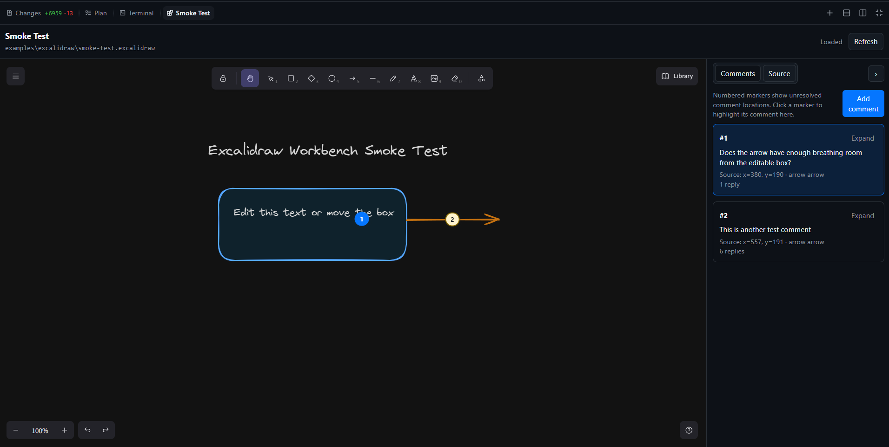

# copilot-toolkit

Personal collection of [GitHub Copilot CLI](https://docs.github.com/en/copilot/using-github-copilot/using-github-copilot-in-the-command-line) extensions, skills, and agents.

## Extensions

| Extension | Tools provided | Description |
|-----------|---------------|-------------|
| **ado-pr-watcher** | `pr_watcher_start`, `pr_watcher_list`, `pr_watcher_stop` | Watches Azure DevOps pull requests for reviewer activity, comment threads, negative votes, and blocking policy failures. Injects follow-up prompts so the Copilot agent can act as the PR author. |
| **ado-build-watcher** | `build_watcher_start`, `build_watcher_list`, `build_watcher_stop` | Watches Azure DevOps build/pipeline runs and notifies the session when they complete or fail, enabling automatic diagnosis and next-step continuation. |
| **excalidraw-workbench** | Canvas: `excalidraw-workbench` | Opens repository `.excalidraw` drawings in a Copilot canvas with the full Excalidraw UI, durable comments/replies, agent actions, and local snapshot capture for visual review. |

### Quick start

After [installing](#install-extensions), the tools are available in any Copilot CLI session:

```
# Watch a PR — auto-detects org/project/repo from your git remote
Watch my PR for reviews

# Watch a PR by URL
Watch this PR: https://dev.azure.com/myorg/myproject/_git/myrepo/pullrequest/12345

# Watch a build/pipeline run
Watch this build: https://dev.azure.com/myorg/myproject/_build/results?buildId=98765

# Open an Excalidraw drawing in a canvas
Open examples/excalidraw/smoke-test.excalidraw in the Excalidraw workbench

# Ask the agent to inspect rendered pixels
Capture a snapshot of the Excalidraw canvas and review the layout

# List active watchers
Show my active watchers

# Stop a watcher
Stop the PR watcher
```

You don't call tools or canvases directly — just describe what you want in natural language and Copilot invokes the right surface. The watchers run as detached background processes and inject events back into your session when something happens. The Excalidraw workbench opens as an interactive canvas panel.

### How watchers work

1. **Start** — Copilot calls `pr_watcher_start` or `build_watcher_start`, which spawns a detached worker process
2. **Poll** — The worker polls Azure DevOps APIs via `az` CLI at a configurable interval (default 60s for builds, 30s for PRs)
3. **Notify** — When the worker detects a change (new review comment, build completed, etc.), it writes an event file
4. **React** — The extension picks up the event and injects a follow-up prompt into your session so Copilot can act on it

### How Excalidraw Workbench works

1. **Open** — Copilot opens the `excalidraw-workbench` canvas with a workspace-local `.excalidraw` file path.
2. **Serve** — The extension starts a loopback-only HTTP server on `127.0.0.1` and serves prebuilt local webview assets from `extensions/excalidraw-workbench/webview/runtime/`.
3. **Edit** — The webview embeds the full Excalidraw editor and saves scene JSON back to the checked-out drawing file.
4. **Comment** — Comments and replies are stored in a stable sidecar file named `<drawing>.comments.json`.
5. **Collaborate** — New comments can be sent to the agent; the agent can list/reply/resolve comments, patch simple element fields, save source, and capture local SVG/PNG snapshot artifacts for visual inspection.

The webview is designed to be portable and offline-friendly: Excalidraw assets are served locally, not loaded from CDNs at runtime. The committed bundle lives under `webview/runtime/` rather than `dist/` so source-folder extension installers that skip conventional build output directories still copy the files required to open the canvas.



## Install extensions

Extensions are **not** distributed through the plugin system — they require the install script.

| What | How installed | What this repo provides |
|------|--------------|------------------------|
| **Extensions** | Install scripts below | `ado-pr-watcher`, `ado-build-watcher`, `excalidraw-workbench` |
| **Skills & agents** | `copilot plugin install` | None yet (placeholders) |

**PowerShell (Windows):**

```powershell
git clone https://github.com/cirvine-msft/copilot-toolkit.git
cd copilot-toolkit
.\install-extensions.ps1
```

**Bash (macOS / Linux):**

```bash
git clone https://github.com/cirvine-msft/copilot-toolkit.git
cd copilot-toolkit
./install-extensions.sh
```

To install only specific extensions:

```bash
./install-extensions.sh ado-build-watcher          # just the build watcher
.\install-extensions.ps1 ado-pr-watcher             # just the PR watcher
./install-extensions.sh excalidraw-workbench        # just the Excalidraw canvas
```

After installing, run `/clear` in the Copilot CLI or restart it to load the new extensions.

### Update

```bash
cd copilot-toolkit
git pull
./install-extensions.sh   # or .\install-extensions.ps1
```

The install scripts use mirror semantics — stale files from previous versions are cleaned up automatically.

### Uninstall

Remove the installed extension directories:

```bash
rm -rf ~/.copilot/extensions/ado-pr-watcher
rm -rf ~/.copilot/extensions/ado-build-watcher
rm -rf ~/.copilot/extensions/excalidraw-workbench
rm -rf ~/.copilot/extensions/lib
```

Then run `/clear` or restart the CLI.

## Plugin system

This repo contains a `plugin.json` manifest for future skills and agents. When skills/agents are published, they'll be installable via:

**From the terminal:**
```bash
copilot plugin install cirvine-msft/copilot-toolkit
```

**From within the CLI:**
```
/plugin install cirvine-msft/copilot-toolkit
```

> **Note:** The plugin system installs skills and agents only — it does **not** install the watcher extensions. Those always require the install scripts above.

## Requirements

- [GitHub Copilot CLI](https://docs.github.com/en/copilot/using-github-copilot/using-github-copilot-in-the-command-line)

For Azure DevOps watcher extensions:

- [Azure CLI](https://learn.microsoft.com/en-us/cli/azure/install-azure-cli) with the Azure DevOps extension
- Azure DevOps access for the repos/pipelines you want to watch

For Excalidraw Workbench development only:

- Node.js 20.19+ and npm to run webview tests/builds. End users do not need npm because prebuilt webview assets are committed and copied by the install scripts.

### Azure CLI setup

```bash
# Install Azure DevOps extension (if not already present)
az extension add --name azure-devops

# Login
az login

# Optionally set defaults so you don't have to pass org/project every time
az devops configure --defaults organization=https://dev.azure.com/YOUR_ORG project=YOUR_PROJECT
```

The extensions auto-detect org/project/repo from your git remote when possible. Explicit values are only needed when auto-detection can't resolve them (e.g., non-ADO git remotes, numeric build IDs without context).

## Troubleshooting

| Problem | Solution |
|---------|----------|
| Tools don't appear after install | Run `/clear` or restart the CLI |
| `az` commands fail with auth errors | Run `az login` to refresh credentials |
| Watcher not detecting changes | Check `pr_watcher_list` / `build_watcher_list` for status; verify Azure DevOps access |
| Extension not loading | Verify files exist in `~/.copilot/extensions/ado-pr-watcher/` |
| Excalidraw canvas opens but assets fail to load | Verify `~/.copilot/extensions/excalidraw-workbench/webview/runtime/index.html` exists, then reinstall and run `/clear` |
| Excalidraw comments disappeared | Check for the sidecar file next to the drawing: `<drawing>.comments.json` |
| Agent needs to inspect visual layout | Ask it to capture an Excalidraw snapshot; the extension writes a local SVG/PNG artifact for inspection |

## License

[MIT](LICENSE)
